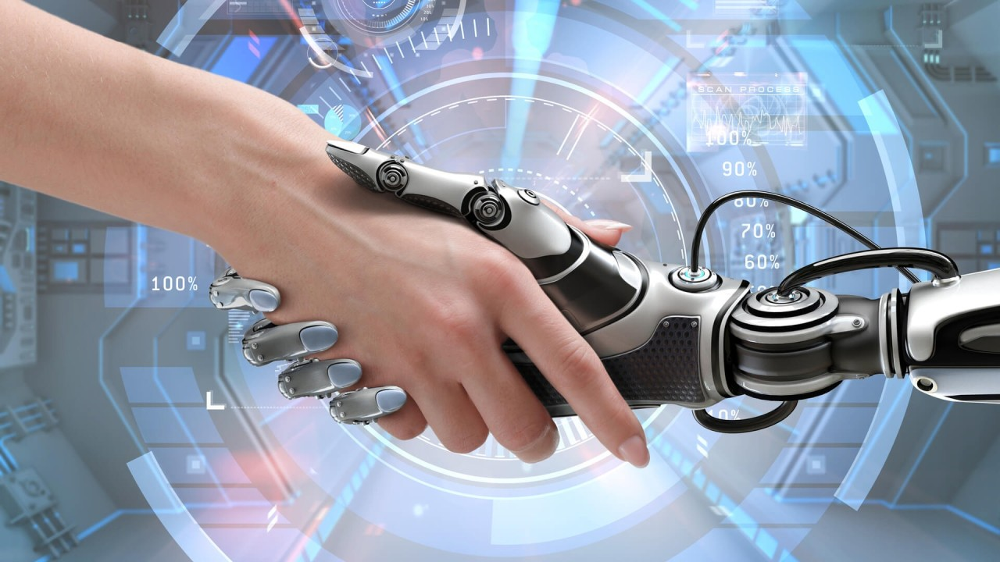

  

# *A Sociedade Dependente de Tecnologia e a Corrida para Acompanhar sua Evolução: Reflexões Inspiradas por Carl Sagan*

>"Vivemos em uma sociedade extremamente dependente de ciência e tecnologia, na qual quase ninguém sabe nada sobre ciência e tecnologia. Esta é uma receita clara para o desastre." Carl Sagan - 1990

Ao ler a frase de Carl Sagan, não pude deixar de refletir sobre o quanto esse alerta, feito há décadas, continua a ecoar nos dias de hoje.. Estamos vivendo um momento em que a tecnologia avança a passos largos, moldando o jeito que vivemos, trabalhamos e nos conectamos. E junto a essa rápida evolução, surge um problema importante: a falta de profissionais qualificados para acompanhar esse ritmo acelerado.

## Alta Demanda e Falta de Profissionais Preparados
Hoje, o mercado de tecnologia vive uma espécie de paradoxo. As empresas estão mais dependentes de profissionais de TI do que nunca, mas ao mesmo tempo, não conseguem encontrar gente preparada para assumir as vagas que estão surgindo. Setores de todos os tipos estão à procura de desenvolvedores, cientistas de dados, especialistas em segurança digital, engenheiros de nuvem, entre outros. A tecnologia virou o eixo central para inovação e crescimento, mas parece que encontrar profissionais realmente prontos para enfrentar os desafios tecnológicos atuais está cada vez mais complicado.
A raiz desse problema, na minha visão, está muito ligada ao que está sendo ensinado nas faculdades e universidades. Enquanto o mundo da tecnologia evolui numa velocidade incrível, o que se vê em muitas instituições de ensino são currículos que não acompanham essas mudanças. Muitos cursos de graduação ainda estão presos a métodos e conteúdos que já não refletem mais a realidade do mercado. E assim, quando os alunos se formam, eles não têm as habilidades práticas ou o conhecimento atualizado que o mercado está procurando.

## A Corrida Contra o Tempo na Tecnologia
É fácil entender por que essa desconexão acontece. A tecnologia está mudando tão rápido que o que é considerado inovador hoje pode ser obsoleto amanhã. Novas ferramentas, linguagens de programação e metodologias surgem o tempo todo. E a verdade é que nem todos conseguem acompanhar esse ritmo alucinante. Muitos saem da faculdade com um bom entendimento teórico, mas falta a prática, a vivência em projetos reais que realmente fazem a diferença no dia a dia das empresas.
E as empresas, por sua vez, acabam ficando em uma situação complicada. Elas precisam de profissionais que consigam entrar no ritmo imediatamente, que saibam trabalhar com as tecnologias mais recentes e estejam prontos para encarar os desafios do mercado. Isso resulta em um mercado com muitas vagas abertas, mas poucas pessoas preparadas para preenchê-las de fato.

## Requalificação e Aprendizado Contínuo: Um Caminho Possível
Diante dessa realidade, é cada vez mais claro que a formação tradicional, por si só, não é mais suficiente. A velocidade com que a tecnologia avança exige que o aprendizado seja algo contínuo. Quem quer se manter relevante nesse mercado precisa estar sempre buscando novos conhecimentos, se atualizando, aprendendo novas ferramentas e metodologias. Essa é uma demanda não só para os profissionais que já estão no mercado, mas também para aqueles que estão entrando agora.
É aí que entram as alternativas de aprendizado mais práticas e focadas no que o mercado precisa. Bootcamps, cursos online, certificações específicas e treinamentos práticos têm sido uma boa resposta para quem quer se adaptar rapidamente. São opções que ajudam a fechar a lacuna entre o que se aprende na teoria e o que se precisa na prática.

## A Tecnologia Como Aliada e Não Inimiga
Com o avanço rápido da tecnologia, especialmente com a chegada da inteligência artificial, muita gente se sente insegura, com medo de perder espaço ou relevância. Mas, pensando bem, a tecnologia está aí para ser uma aliada. O que ela faz é tornar o trabalho mais eficiente, automatizar tarefas repetitivas e liberar tempo para que possamos focar em atividades mais criativas e estratégicas.
A questão é como podemos mudar a percepção e ver essas inovações como oportunidades. A tecnologia foi feita para facilitar a vida, para nos dar mais liberdade, e não o contrário. Só precisamos aprender a usá-la a nosso favor.

## Reflexão Final
A frase de Carl Sagan, embora tenha sido proferida há décadas, ainda ressoa com uma urgência incrível nos dias de hoje. Estamos em uma corrida para acompanhar a evolução tecnológica, e a lacuna entre o que as faculdades oferecem e o que o mercado precisa é um sinal claro de que precisamos de abordagens mais dinâmicas e conectadas com a realidade. A verdadeira transformação digital só ocorrerá quando o conhecimento e as habilidades acompanharem o ritmo da inovação, capacitando profissionais a utilizarem a tecnologia não como um fim, mas como um poderoso meio para alcançar novos patamares de desenvolvimento e criatividade.

## Dica de Leitura

 - [A Era Da Inteligência Artificial: O Impacto Nos Negócios, Na Educação, No Lar E Na Sociedade](https://amzn.to/4dTdjMw)
 - [A era da ia: e Nosso Futuro Como Humanos](https://amzn.to/3B451CK)
