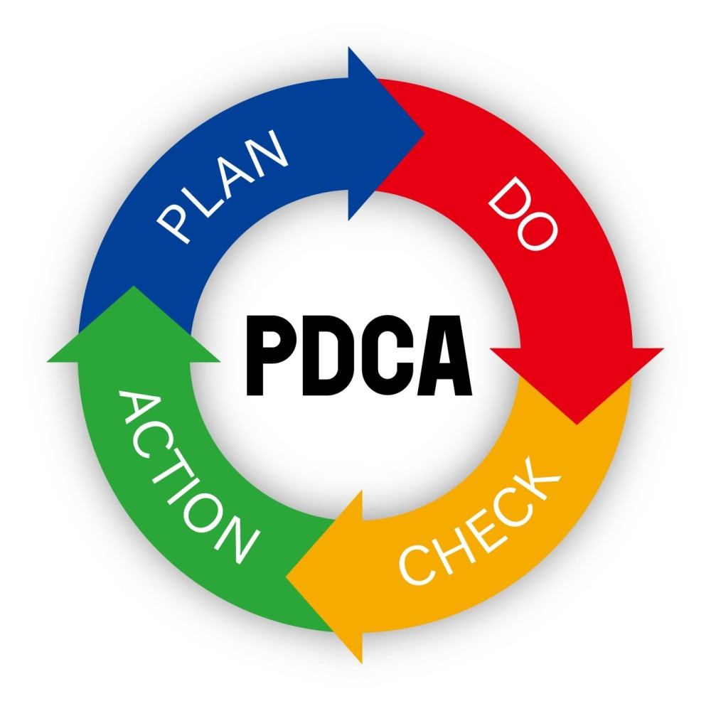

# *Lidando com o Excesso de Informação: Como Manter sua Produtividade No Caos*

No passado, o grande desafio para muitos profissionais era a falta de informação. No entanto, com a revolução digital, o problema se inverteu: hoje, temos um excesso de informações, atualizações constantes e uma infinidade de ferramentas de gestão. Esse cenário pode facilmente levar à sobrecarga cognitiva e à improdutividade. Neste artigo, discutirei como navegar nesse mar de informações e manter a produtividade em alta.

## O Novo Desafio: Excesso de Informação
Vivemos em uma era onde a informação está a apenas um clique de distância. Embora isso tenha inúmeros benefícios, como o acesso rápido ao conhecimento e a comunicação instantânea, também traz desafios significativos. A sobrecarga de informações pode resultar em:

- Paralisia por Análise: Com tantas opções e dados disponíveis, tomar decisões pode se tornar uma tarefa exaustiva.
- Distrações Constantes: Notificações, e-mails e mensagens podem interromper o fluxo de trabalho e diminuir a concentração.
- Atualizações Constantes: Ferramentas e tecnologias estão em constante evolução, exigindo adaptação contínua.

Com a evolução tecnológica e o volume crescente de dados que chegam até nós, não conseguimos analisar e ler tudo. Será que esse excesso de informação disponível não está se tornando desinformação? A avalanche de dados muitas vezes dificulta a distinção entre o que é relevante e o que é irrelevante, potencialmente nos levando a decisões menos informadas.

## Ferramentas de Gestão: Benção ou Maldição?
Embora existam inúmeras ferramentas de gestão projetadas para melhorar a produtividade, o uso excessivo ou inadequado dessas ferramentas pode ter o efeito contrário. Algumas armadilhas comuns incluem:

- Complexidade Excessiva: Ferramentas com muitas funcionalidades podem ser complicadas de usar e configurar. 
- Falta de Integração: Utilizar várias ferramentas que não se comunicam bem entre si pode criar mais trabalho.
 - Dependência Tecnológica: Confiar demais em ferramentas pode reduzir a capacidade de resolver problemas de forma criativa e independente.

## Ansiedade com a IA e o Impacto na Produtividade
Com o avanço da Inteligência Artificial (IA), muitos profissionais têm experimentado ansiedade, temendo pela segurança de seus empregos. No entanto, é importante entender que a IA deve ser vista como uma aliada na nossa produtividade. Ela foi desenvolvida para auxiliar e não substituir completamente o trabalho humano. Outros, por outro lado, podem ficar paralisados, acreditando que ferramentas como o ChatGPT resolverão todos os problemas e fornecerão todas as soluções. Essa dependência excessiva pode atrofiar nossa capacidade criativa e o senso crítico, que são características exclusivamente humanas.

## O Impacto dos Gurus da Internet
Hoje, vemos muitos gurus na internet, cada um com sua visão e informações. Isso pode nos deixar perdidos e com uma sensação de impotência. Quantas vezes você já se pegou pensando que está desatualizado ou ficando para trás? Ficamos em uma busca incessante de nos atualizar, fazer novos cursos e ler novos livros que os gurus recomendam. Na verdade, estão nos sobrecarregando com informações que não conseguimos absorver e concluir, levando a uma sensação de fracasso e incapacidade.

>Qual foi a última vez que você se sentiu tentado a fazer um novo curso na internet? Quantas vezes se inscreveu em um curso e concluiu? Quantos livros começou a ler e terminou, e dos que terminou, quantos realmente tirou novos insights?

## Estratégias para Manter a Produtividade
Para superar esses desafios e manter a produtividade em alta, aqui estão algumas estratégias práticas:

- Simplifique suas Ferramentas Escolha ferramentas de gestão que sejam intuitivas e se integrem bem ao seu fluxo de trabalho. Evite usar mais ferramentas do que o necessário e priorize aquelas que realmente agregam valor.
- Gerencie seu Tempo e Atenção (Técnica Pomodoro): Trabalhe em blocos de tempo com pausas regulares para manter a concentração.
- Bloco de Tempo Sem Distrações: Reserve períodos do dia para trabalho profundo, sem interrupções. 
- Desative Notificações: Limite as notificações apenas ao essencial para evitar distrações constantes. 
- Técnica 80/20: Concentre-se nas tarefas que realmente trazem resultados significativos. Tenho utilizado muito essa técnica em minha vida e ela tem sido fundamental para melhorar minha eficiência.
- Adote uma Mentalidade de Aprendizado Contínuo Atualização Contínua: Reserve tempo regularmente para se atualizar sobre novas tecnologias e ferramentas. 
- Curadoria de Conteúdo: Siga fontes confiáveis e de alta qualidade para filtrar o excesso de informações.
- Organize e Priorize Tarefas Método GTD (Getting Things Done): Capture, processe, organize, revise e execute suas tarefas de forma eficiente. 
- Matriz de Eisenhower: Priorize tarefas com base em urgência e importância.

>Lembre-se de que, às vezes, estamos gastando muito tempo buscando a ferramenta perfeita, a técnica perfeita, ou o modo perfeito de fazer as coisas, em vez de sermos eficazes. A busca incessante pela perfeição pode nos paralisar e impedir que realizemos o trabalho de forma eficiente.

## DCA para Melhoria da Produtividade Pessoal em Meio ao Excesso de Informação

**Planejar (Plan):**
Definição do Problema: Identificar sobrecarga de informações que afeta a produtividade pessoal.
Estabelecimento de Metas: Aumentar a eficiência pessoal em 30% nos próximos três meses.
Análise de Causas: Avaliar fontes de distração e desperdício de tempo, como redes sociais não produtivas e excesso de leitura sem foco.

**Fazer (Do):**
Implementação do Plano de Ação: Definir um horário específico para verificar e-mails e redes sociais, limitando o tempo gasto.
Organização de Informações: Utilizar ferramentas de gestão de tempo e organização, como técnicas de Pomodoro para manter o foco durante períodos dedicados ao trabalho.

**Verificar (Check):**
Monitoramento de Desempenho: Registrar e acompanhar a produtividade diária através de um diário ou aplicativo de acompanhamento.
Avaliação de Resultados: Comparar a quantidade de tarefas concluídas e a qualidade do trabalho antes e após a implementação das mudanças.

**Agir (Act):**
Ações Corretivas: Se os resultados não atenderem às metas estabelecidas, identificar as causas principais, como hábitos improdutivos, e ajustar o plano de ação.

Implementação de Melhorias: Integrar práticas eficazes, como revisão semanal de objetivos e ajustes contínuos no gerenciamento de informações, para sustentar melhorias na produtividade pessoal.
Ao aplicar o ciclo PDCA de forma consistente, é possível gerenciar de maneira eficaz o excesso de informações e melhorar significativamente a produtividade pessoal, mantendo o foco nas atividades mais importantes e reduzindo distrações.

## Conclusão
Navegar pelo excesso de informações e manter a produtividade em um mundo em constante mudança é um desafio, mas com as estratégias certas, é possível transformar esse cenário a seu favor. Simplifique suas ferramentas, gerencie seu tempo e atenção, adote uma mentalidade de aprendizado contínuo e organize suas tarefas de forma eficaz. Com essas práticas, você pode se destacar e alcançar seus objetivos, mesmo em meio ao turbilhão de informações.
Eu também me identifico com muitos dos pontos discutidos aqui. Muitas vezes, me sinto sobrecarregado pela quantidade de informações e ferramentas disponíveis, sem saber por onde começar. Para manter o foco, desenvolvi algumas estratégias pessoais, como:
Priorizar Tarefas: Uso a Matriz de Eisenhower para classificar minhas tarefas e focar no que é realmente importante e urgente.
Intervalos Regulares: A Técnica Pomodoro tem sido uma aliada para manter minha concentração e energia ao longo do dia.
Limitar Distrações: Desativo notificações desnecessárias e reservo períodos específicos do dia para verificar e-mails e mensagens.
Aplicar a Técnica 80/20: Concentro-me nas atividades que trazem os maiores resultados, garantindo que meu tempo seja investido de forma eficiente.
Quero saber: O que você faz para manter o foco e evitar a sobrecarga de informações? Compartilhe suas estratégias nos comentários abaixo! Juntos, podemos aprender e inspirar novas maneiras de melhorar nossa produtividade.

## Dicas de leitura:
[A arte de fazer acontecer: Guia prático](https://amzn.to/461Q8wt)
[O princípio 80/20: Os segredos para conseguir mais com menos nos negócios e na vida](https://amzn.to/3S6V3X0)
[Mindset do foco - Aprenda a eliminar as distrações e alcance mais resultados com menos esforço](https://amzn.to/4cxiMb7)